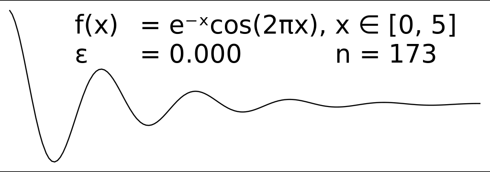

% RDP, linear, diagrams and formatting

# Step 0. Explain the algorithm.

You take a curve and approximate it with a line.

If that's terrible, cut it in half where it's most terrible.

Repeat.

It's called RDP, or Ramer-Douglas-Peuker. It's used in robotics, aparrently.

	
Thomas Peucker (Geographer/Computer Scientist) changed his last name to Poiker to reflect the pronunciation because Americans and Canadians were pronouncing Peucker more like Puker.

# Step 1. Bring meaning to your futile existance by typing

Shun the inflexible contexts and load the strings some more, we won't get
caught.

```haskell
{-# LANGUAGE FlexibleContexts          #-}
{-# LANGUAGE NoMonomorphismRestriction #-}
{-# LANGUAGE OverloadedStrings         #-}
{-# LANGUAGE ViewPatterns              #-}

module Main where
```

# Step 2. Control.Arrow is cool

```haskell
import           Control.Arrow
```

# Step 3. Import things.

```haskell
import           Data.Coerce
import           Data.Function
import           Data.List
import           Diagrams.Backend.Cairo.CmdLine
import           Diagrams.Prelude
import           Formatting hiding (text)
import           Linear.Matrix
```

# Step -1. Consult the Oracle, conveniently introducing V2

```haskell
add1 :: Num a => V2 a -> V3 a
add1 (V2 x y) = V3 x y 1
```

# Step 3. Determine the perpindicular distance from a line

Because everybody hates determinants, we will now have a pun intermission.

# The most fun you will ever have with determinants.

\textbf{The Hessians were a determinant of the American Revolutionary War.} -
the internet

# Back to work.

* The area of a triangle is half the 3x3 determinant of the matrix of the
  coordinates of its vertices as rows and 1s appended.
* The perpindicular distance from the line implied by two points to a third
  point has something to do with triangles.
* I remember triangles. They're half the shape Parallelogram ever was. $A = \frac{hb}{2}$
* So the perpindicular distance is probrably the height, $h = \frac{2A}{b}$

```haskell
perpDist :: (Num a, Fractional a, Floating a)
         => V2 a -> V2 a -> V2 a -> a
perpDist (add1 -> begin) (add1 -> end) (add1 -> point) =
    abs $ det33 (V3 begin end point)
        / distanceA begin end
```

# Step 5. Type the algorithm

```haskell
rdp :: (Ord a, Floating a) => a -> [V2 a] -> [V2 a]
rdp epsilon line
  | length line > 2 =
    let middle = tail $ init line
        (begin, end) = (head &&& last) line
        measured = fmap (perpDist begin end) middle
        (dist, os) = maximumBy (compare `on` fst) (zip measured [2..])
    in if dist > epsilon
       then let (l,r) = splitAt os line
            in init (rdp epsilon l) <> rdp epsilon r
       else [begin, end]
  | otherwise = line
```

# Step 6. Moisten the oscillator

```haskell
input :: [V2 Double]
input =
    let dampedOscillator t = exp (negate t)
                           * cos (2*pi*t)
    in [V2 x (dampedOscillator x)
       | x <- [0, 0.01 .. 5]
       ]
```

# Step 7.

I don't like 7. We will put the ugly code here.

```haskell
renderate :: Double -> [V2 Double]
          -> QDiagram Cairo V2 Double Any
renderate epsilon xs =
    topLeftText ("...redacted...\n" <> status)
    === coerce xs # fromVertices # strokeLine
  where
    status = formatToString ("\tε \t= " % fixed 3
                            % "\t\t" % "n = " % int)
                            epsilon (length xs)
```


# Step 8.

8 is my favorite number, we will put more ugly code here.

This code is intentionally left too fat for its slide.

```haskell
main :: IO ()
main =
  gifMain [ (renderate epsilon (rdp epsilon input) # bgFrame 0.1 white
                                                   # fontSizeG 0.2
                                                   # font "dejaVuSans"
            , 10 )
           | epsilon <- [0, 0.001 .. 0.075] ]
```

# Step 9. ???



